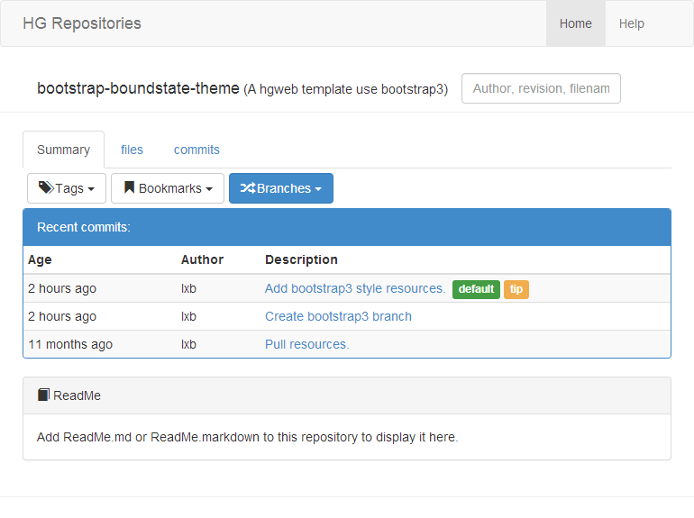

# BoundState Theme for HgWeb

  A clean, modern theme for Mercurial's [hgweb](http://mercurial.selenic.com/wiki/HgWebDirStepByStep]) using the [Bootstrap](http://twitter.github.com/bootstrap/) CSS framework.

  And this is a branch that use bootstrap3 series.

## Installation

Download all files into temporary folder.

Copy folder `boundstate` in your hgweb themes folder
(`/usr/share/mercurial/templates` on default Ubuntu installs).

Copy contents in `static` to hgweb themes `static` folder (`/usr/share/mercurial/templates/static`).

Edit your `hgweb.config` file to use the `boundstate` theme:

    [web]
    style = boundstate

## About source code

License:(??)

- Folder `boundstate` is main template folder
- Folder `static/b3` is bootstrap style version 3.3.1
- Folder `static/boundstate` place assets used by this theme.

notes:
  new summary.tmpl added for show readme file (use hgweb plugin).

## Screenshots

